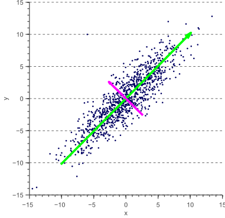

title: "Introduction to Deep Learning with Python"
author:
    name: Dan Koch
    url: https://github.com/dmkoch/deep-learning-intro
    twitter: dkoch
theme: sudodoki/reveal-cleaver-theme
output: presentation.html

--

## Introduction to Deep Learning with Python
### CharPy meetup March 21, 2017

--

## Overview

* What is it?

* Where did it come from?

* How do I get started?

* What can I do with it?

--

## What is deep learning?
  * A branch of machine learning, which is a type of artificial intelligence "AI"
  * Computers learn how to do a task without being explicitly programmed
  * Based on "Artificial Neural Networks" which model the brain
  * Lots of layers, tons of data, GPUs
--

## What isn't deep learning?
  * Not Artificial General Intelligence or "Strong AI." It's "Applied / Narrow / Weak AI."
  * Not going to replace humans (yet)

--

## Machine Learning

 * Supervised
   * Labeled training data
   * e.g. Regression, Classification
 * Unsupervised
   * No training data
   * e.g. Clustering, Principal Component Analysis

--


Source: http://machinelearningmastery.com/

--

## Regression


--

## Linear Classifiers


--

## Clustering


--

## PCA


--

## Training data

| SqFt | Bedrooms | Baths | Price  |
| ---- | -------- | ----- | ------ |
| 1500 | 2        | 2     | 200000 |
| 2500 | 3        | 2     | 250000 |
| 3000 | 3        | 3     | 300000 |

--

## Neural Networks: Perceptron


--

## Deep Neural Network


--

## Why deep learning


Source: Andrew Ng, via http://machinelearningmastery.com/

--

## Getting started

* Practical Machine Learning
  * Data cleaning / feature extraction
  * Data pipelines
  * Model selection sometimes less important than features
  * Evaluation of results
* Theoretical Machine Learning
  * Heavy Math
  * PhD level research

--

## Start with general machine learning course

https://www.coursera.org/learn/machine-learning

 * Andrew Ng, founder of Coursera
 * Good overview
 * Octave instead of Python :(

--

## Deeper general machine learning specialization

https://www.coursera.org/specializations/machine-learning

 * In-depth coverage of regression, classification, clustering

--

## Finally, start deep learning

http://course.fast.ai/

 * State of the art
 * Aimed at developers, not PhD students
 * Only high school math needed

--

## Udacity

https://www.udacity.com/course/deep-learning-nanodegree-foundation--nd101

 * Python
 * Cool projects: Image classification, TV script generation, Face generation

--

## Data science from scratch


--

## Advanced Deep Learning

http://deeplearning.stanford.edu/tutorial/

http://neuralnetworksanddeeplearning.com/chap1.html


--

## Laundry list of resources

https://github.com/ZuzooVn/machine-learning-for-software-engineers


--

## Kaggle

  * Best way to learn is to work a problem, so enter a Kaggle competition
  * https://www.linkedin.com/pulse/approaching-almost-any-machine-learning-problem-abhishek-thakur
  * xgboost

--

## I just want to mess around with some examples

--

## Cloud services

 * Amazon, Google, Microsoft
 * Speech recognition
 * Language translation
 * Image recognition
 * Just make API calls

--

## Keras

  * High level API, on top of TensorFlow or Theano
  * Many, many practical examples
  * https://github.com/fchollet/keras/tree/master/examples

--

## Kur

  * Even simpler -- describe your models with YAML
  * https://github.com/deepgram/kur

--

## Kur Example: MNIST


--

    ```
    git clone https://github.com/deepgram/kur
    cd kur/examples
    ```
--

    ```
    ---
    train:
      data:
        - mnist:
            images:
              url: "http://yann.lecun.com/exdb/mnist/train-images-idx3-ubyte.gz"
            labels:
              url: "http://yann.lecun.com/exdb/mnist/train-labels-idx1-ubyte.gz"

    model:
      - input: images
      - convolution:
          kernels: 64
          size: [2, 2]
      - activation: relu
      - flatten:
      - dense: 10
      - activation: softmax
        name: labels

    include: mnist-defaults.yml
    ```

--

    ```
    > kur train mnist.yml
    Downloading: 100%|█████████████████████████████████| 9.91M/9.91M [03:44<00:00, 44.2Kbytes/s]
    Downloading: 100%|█████████████████████████████████| 28.9K/28.9K [00:00<00:00, 66.1Kbytes/s]
    Downloading: 100%|█████████████████████████████████| 1.65M/1.65M [00:31<00:00, 52.6Kbytes/s]
    Downloading: 100%|█████████████████████████████████| 4.54K/4.54K [00:00<00:00, 19.8Kbytes/s]

    Epoch 1/10, loss=1.524: 100%|███████████████████████| 480/480 [00:02<00:00, 254.97samples/s]
    Validating, loss=0.829: 100%|█████████████████████| 3200/3200 [00:03<00:00, 889.91samples/s]
    ```

--
    ```
    > kur evaluate mnist.yml
    Evaluating: 100%|██████████████████████████████| 10000/10000 [00:06<00:00, 1537.74samples/s]
    LABEL     CORRECT   TOTAL     ACCURACY
    0         969       980        98.9%
    1         1118      1135       98.5%
    2         910       1032       88.2%
    3         926       1010       91.7%
    4         923       982        94.0%
    5         735       892        82.4%
    6         871       958        90.9%
    7         884       1028       86.0%
    8         818       974        84.0%
    9         868       1009       86.0%
    ALL       9022      10000      90.2%
    ```
